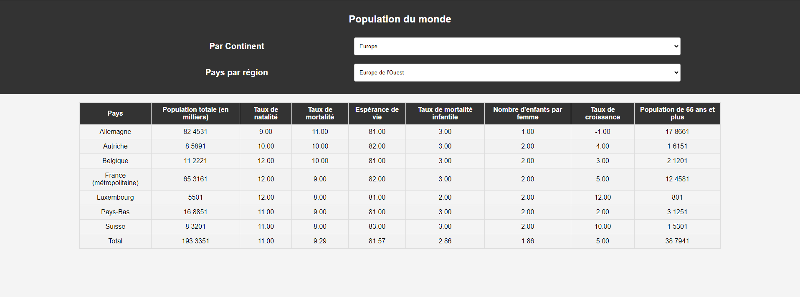

# Population du Monde - Projet PHP

Ce projet PHP récupère et affiche des données de population mondiale à partir d'une base de données MySQL. Les données utilisées dans ce projet ont été obtenues à partir du site de l'INED (Institut national d'études démographiques) en 2018.

## Description

Ce projet est conçu pour afficher les statistiques de population de différents continents, régions et pays du monde. Les données sont organisées en fonction des continents et des régions. Les statistiques affichées comprennent la population totale, le taux de natalité, le taux de mortalité, l'espérance de vie, le taux de mortalité infantile, le nombre d'enfants par femme, le taux de croissance et la population de plus de 65 ans.

## Captures d'écran

## Auteur

Lenoir Yohan
